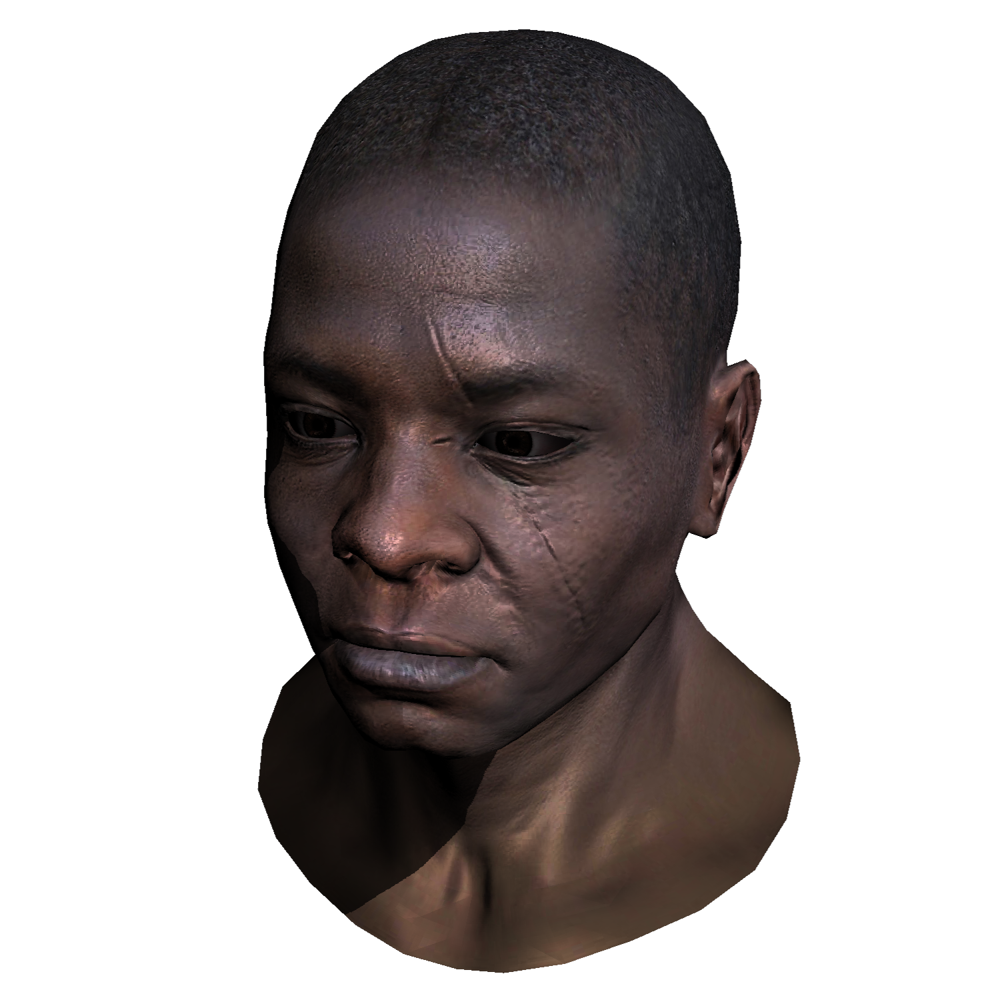

# TinyRenderer-CSharp

> Original repository:
> [ssloy/tinyrenderer : A brief computer graphics / rendering course](https://github.com/ssloy/tinyrenderer)

## Snapshots for every lessons:

- [Lesson 1](https://github.com/Rokukkkk/TinyRenderer-CSharp/tree/5412b50a64445f3b148d21b4b3fec251d35e723e)
- [Lesson 2](https://github.com/Rokukkkk/TinyRenderer-CSharp/tree/db9f14698edb121e7924eb0ee81cf96749b73a49)
- [Lesson 3](https://github.com/Rokukkkk/TinyRenderer-CSharp/tree/5c03f2c54ec89f191e95513779973e816b768d05)
- [Lesson 4](https://github.com/Rokukkkk/TinyRenderer-CSharp/tree/d601be7e00f4e002449fda7f4e55caa27ebbb9c3)
- [Lesson 5](https://github.com/Rokukkkk/TinyRenderer-CSharp/tree/d8cbb5a8ab2a83dfd12230860932fcc7f854af8a)
- [Lesson 6](https://github.com/Rokukkkk/TinyRenderer-CSharp/tree/65805bbafcfff488ff9ba30d189af217e2c53497)
- [Lesson 6b(Tangent Normal Map)](https://github.com/Rokukkkk/TinyRenderer-CSharp/tree/13344c563cb56539d8cafe45fd00d98700d33fc5)

